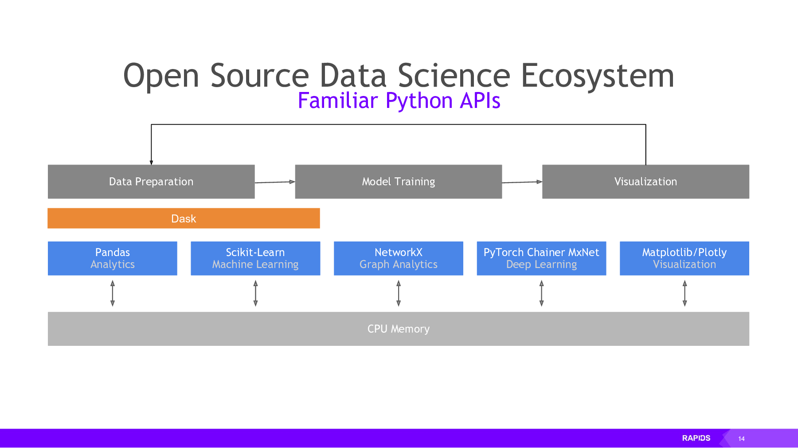

# sstable-to-arrow client

The big picture goal of this project is to enable GPU-accelerated analytic queries (using the
[RAPIDS](https://rapids.ai/index.html) ecosystem) on the Cassandra database.

RAPIDS uses [Apache Arrow](http://arrow.apache.org/) as the underlying
memory format. Apache Arrow based on columns rather than rows, allowing faster analytic
queries, and also supports zero-copy reads for extremely fast data access.

It also includes an inter-process communication (IPC) mechanism used to transfer
an Arrow record batch (i.e. a table) between processes. The IPC format is
identical to the in-memory format, which eliminates any extra copying or
de/serialization costs.

sstable-to-arrow allows you to access your Cassandra data in the form of an Apache Arrow Table,
which can then be used by many applications.

## Getting started

See [this blog post](https://www.datastax.com/blog/analyzing-cassandra-data-using-gpus-part-2)
for detailed instructions.

1. Pull the sstable-to-arrow Docker container: 

`docker pull datastaxlabs/sstable-to-arrow`

3. Download the `no_cuda.py` script: 

`curl -LO https://raw.githubusercontent.com/datastax/sstable-to-arrow/main/client/no_cuda.py`

4. Create a new virtualenv inside this directory:  
 
`python -m venv ./myvenv`

5. Activate the virtualenv:
  
`source ./myvenv/bin/activate`

6. Install the requirements: 
 
`pip install pandas pyarrow`

7. Launch the sstable-to-arrow server with Docker: 
 
`docker run --rm -it -p 9143:9143 --name sstable-to-arrow datastaxlabs/sstable-to-arrow -s`

8. Run
 
`python no_cuda.py`

## Next steps

- improve support for different types and cases in current implementation (nested UTD's and FROZEN)
- build a native SSTable reader in the cuDF project, e.g. `cudf.from_sstable()`
- read DSE SSTable format

## Other applications

- parsing different SSTable versions across different programming languages could help in migration from Cassandra to Astra
- could also use Kaitai to parse and document CQL protocol

## Speed comparison

Speed of machine learning tasks on a GPU compared to a CPU (from [RAPIDS](https://rapids.ai/about.html)):

The RAPIDS ecosystem is highly accessible, and most common machine learning and
data science libraries for CPUs have an equivalent RAPIDS library that runs on
the GPU:

